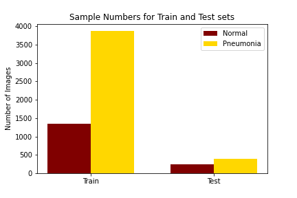
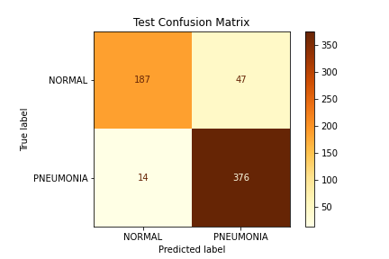
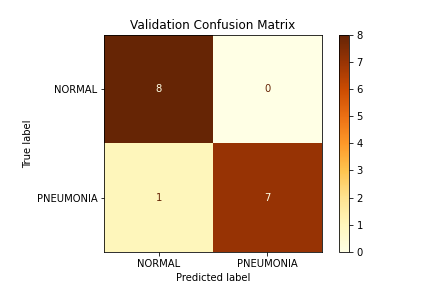
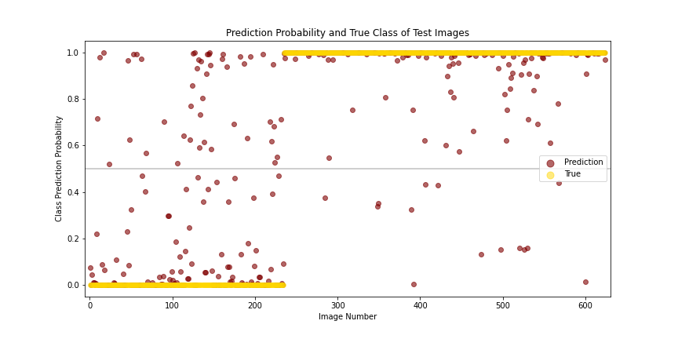

# Pneumonia Classification

## Overview
Pneumonia infections lead to inflamed lungs and are caused by either bacteria or a virus. It can be quite serious, especially in young children and adults over 65. More than 40,000 people die of pneumonia each year. Early treatment can lead to better outcomes, so quick, easily available diagnostics are important to improve survival rates.

## Business Problem
Pulmonologists at a local hospital would like to improve their ability to quickly and accurately determine the origin of pneumonia. The origin of pneumonia dictates treatment methods, but the methods used to determine the origin either take time or are expensive. Chest x-rays are commonly used to diagnose an infection but cannot be used to determine the origin of the infection with the naked eye. Thus, training a model to recognize the difference in infection origin in x-rays would save time and money. The first step in this process is to train a model to recognize the difference between normal and infected lungs on chest x-rays.

## Data
Image files of chest x-rays from patients with normal and pneumonia infected lungs were obtained from [Kaggle](https://www.kaggle.com/paultimothymooney/chest-xray-pneumonia). There are three folders containing training, testing and validation sets. Each set has two subfolders dividing the x-rays into 'Normal' or 'Pneumonia' classes. There are 5216 training images, 624 test images and 16 validation images.

The data is imbalanced in favor of the 'Pneumonia' class.

## Method
I used a DirectoryIterator to augment the training data. The data was trained on a basic convolutional neural network. I also used the InceptionV3 pretrained model.

## Results
I was able to improve the basic model step-wise by adding data augmentation, class weights, reduced learning rate on plateau, dropout layers and using the RMSprop optimizer. In the end, the pretrained model gave the best results. It did pretty well on the test data dn very well on the small holdout validation set.

It was much better at predicting the 'pneumonia' class than the 'normal' class.

## Conclusions & Future Directions
This modeling project producted a decent model for predicting pneumonia infections using x-ray images. However, there are still many patients with pneumonia who would be missed, and quite a few normal patients who would be mis-diagnosed as well. More work would need to be done on this model to make it adequate for diagnosing patients. Additionally, including classes for origin of infection would be necessary for this model to be useful in a clinical setting.
